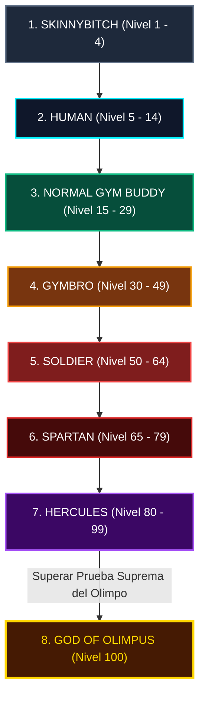

# ⚡ OLIMPIA LEVELING

<p align="center">
  
</p>

<p align="center">
  <em>«De Skinny Bitch a Dios del Olimpo — Sistema Holográfico de Gamificación del Entrenamiento»</em>
</p>

<p align="center">
  <a href="#-novedades-v021"></a>
  <a href="#-pruebas-automatizadas"></a>
  <a href="#-pruebas-automatizadas"></a>
  <a href="#"></a>
  <a href="#"></a>
  <a href="#"></a>
</p>

---

## 📑 Tabla de Contenidos

- [🏛️ Visión del Proyecto](#-visión-del-proyecto)
- [⚡ Novedades de la Versión 0.2.1](#-novedades-de-la-versión-021)
- [🎮 Mecánicas de Juego y Progresión](#-mecánicas-de-juego-y-progresión)
  - [1. Mapa Anatómico & 14 Músculos con Heatmap](#1-mapa-anatómico--14-músculos-con-heatmap)
  - [2. Jerarquía de los 8 Rangos del Olimpo](#2-jerarquía-de-los-8-rangos-del-olimpo)
  - [3. Curva de Experiencia Compuesta (+15%)](#3-curva-de-experiencia-compuesta-15)
  - [4. Pruebas Legendarias & Penalización de Medianoche](#4-pruebas-legendarias--penalización-de-medianoche)
  - [5. Mazmorras Semanales & Regla de Balance Muscular (T - 2)](#5-mazmorras-semanales--regla-de-balance-muscular-t---2)
  - [6. Poder de Combate (Combat Power - CP)](#6-poder-de-combate-combat-power---cp)
- [🛠️ Arquitectura Técnica](#️-arquitectura-técnica)
- [🚀 Guía de Instalación y Puesta en Marcha](#-guía-de-instalación-y-puesta-en-marcha)
  - [Compilación del APK para Android (Release)](#compilación-del-apk-para-android-release)
  - [Ejecución en Entorno de Desarrollo (Desktop / Móvil)](#ejecución-en-entorno-de-desarrollo-desktop--móvil)
  - [Servidor Dashboard de Calibración (FastAPI)](#servidor-dashboard-de-calibración-fastapi)
- [🔐 Seguridad y Cuentas por Defecto](#-seguridad-y-cuentas-por-defecto)
- [🧪 Pruebas Automatizadas](#-pruebas-automatizadas)

---

## 🏛️ Visión del Proyecto

**Olimpia Leveling** transforma la rutina solitaria de pesas en una experiencia de rol y superación mitológica. Inspirada visualmente en el **Sistema de Jin-Woo (Solo Leveling)** y cimentada en la jerarquía épica del **Olimpo Griego**, la aplicación monitoriza cada levantamiento, calcula el tonelaje efectivo y traduce las series en experiencia viva (XP) distribuida de manera biomecánica entre tus músculos.

> *"El Sistema no perdona la negligencia ni premia la desproporción. Solo aquellos que forjen un físico simétrico y derroten a sus límites alcanzarán el trono dorado de los dioses."*

---

## ⚡ Novedades de la Versión 0.2.1

La versión **0.2.1** introduce una renovación masiva en la experiencia de entrenamiento en vivo, cálculo matemático y compartición social:

| Módulo | Característica | Detalle Técnico |
| :--- | :--- | :--- |
| **📜 Historial** | **Última Rutina & Crónicas** | Tarjeta visual en perfil con duración exacta, XP y botón **Repetir Rutina**, junto a un modal histórico cronológico persistente en SQLite. |
| **🔥 Series** | **Series al Fallo (x2 XP)** | Selector interactivo de tipos de serie: `Calentamiento` (0.5x XP), `Normal` (1.0x XP) y `Al Fallo / Efectiva` (**multiplicador estricto x2.0 XP**). |
| **⚖️ Cálculo** | **Calculadora Inversa de Discos** | Modos directo e inverso: calcula cuántos discos montar (20, 10, 5, 2.5, 1.25 kg) o el peso resultante sumando discos a la barra (20, 15, 10 o 0 kg). |
| **🔍 Filtros** | **Equipamiento y Agarre** | Filtros por chips tácticos en la biblioteca de ejercicios: Barra, Mancuerna, Polea, Máquina, Corporal; agarres Prono, Supino y Neutro. |
| **🖼️ Visual** | **Miniaturas de Ejercicios** | Miniaturas ilustrativas integradas junto al nombre en biblioteca, editor y pantalla activa. |
| **↩️ Control** | **Deshacer Rápido (Undo)** | Botón de emergencia durante el entrenamiento para revertir al instante la última serie errónea y recalcular el XP muscular. |
| **🌐 Ajustes** | **Unidades KG / LBS** | Conmutador de unidades métricas e imperiales con conversión matemática y guardado persistente. |
| **📝 Notas** | **Anotaciones Tácticas** | Registro de sensaciones y parámetros por ejercicio y por serie individual. |
| **🔀 Rutinas** | **Reordenación Drag & Drop** | Reorganización táctil mediante `ReorderableListView` de ejercicios al estructurar la rutina. |
| **🔄 Sustitución**| **Sustituir por Alternativa** | Botón durante la sesión activa para cambiar un ejercicio ocupado por otro con idéntico grupo muscular. |
| **📲 Compartir** | **Códigos para WhatsApp** | Codificación alfanumérica URL-safe (`OLM:...`) para exportar e importar rutinas completas en un clic. |
| **🏆 Récords** | **Detector Automático de PR** | Celebración divina inmediata con banner holográfico al romper tu mejor marca personal. |
| **📈 Progresión**| **Sobrecarga Progresiva** | Badge inteligente que sugiere aumentos calculados (+2.5 kg o +1 rep) basados en el historial. |
| **📱 Pantalla** | **Wake Lock (Always On)** | Modo pantalla siempre encendida durante el combate contra el hierro, desactivable en ajustes. |
| **⏱️ Descanso** | **Vibración Háptica & Sonido** | Alerta táctil y sonora distintiva al expirar el descanso con botones de +15s, +30s y salto directo. |
| **⏸️ Sesión** | **Pausa de Emergencia** | Suspensión segura de la sesión sin penalización ni conteos regresivos mientras atiendes una interrupción. |

---

## 🎮 Mecánicas de Juego y Progresión

### 1. Mapa Anatómico & 14 Músculos con Heatmap
Una vista anatómica dual (Frontal y Dorsal) renderiza cada uno de los 14 grupos musculares con un mapa de calor reactivo según su nivel individual:
- **Nivel 1 – 4**: Gris / Skinny (`#64748B`)
- **Nivel 5 – 14**: Azul Neón del Sistema (`#00F0FF`)
- **Nivel 15 – 29**: Verde Cazador (`#10B981`)
- **Nivel 30 – 49**: Oro Espartano (`#F59E0B`)
- **Nivel 50 – 79**: Rojo Hércules (`#EF4444`)
- **Nivel 80 – 100**: Púrpura Divino (`#A855F7`) / Oro Divino (`#FFD700`)

### 2. Jerarquía de los 8 Rangos del Olimpo



### 3. Curva de Experiencia Compuesta (+15%)
- **Niveles 1 a 4**: 100, 200, 300, 400 XP fijos.
- **Nivel 5**: 1,000 XP.
- **A partir del Nivel 6**: Cada nivel subsiguiente exige un incremento compuesto del **15%** respecto al anterior:
$$\text{XP Requerida}(L) = 1000 \times (1.15)^{(L - 5)}$$
- **Nivel 99 a 100**: La ascensión a dios requiere **20 veces más XP** que el salto previo, convirtiendo el nivel 100 en un logro titánico.

### 4. Pruebas Legendarias & Penalización de Medianoche
- 4 misiones legendarias a elegir: *100 Flexiones, 100 Sentadillas, 100 Abdominales o 10 km de Carrera*.
- **Penalización**: Si no se registra su cumplimiento antes de las 23:59:59, el Sistema aplica **-1 Nivel Total**.
- **Rachas & Tokens**: 7+ días (+5% XP), 30+ días (+10% XP). Cada 6 días de racha se otorga 1 Token de Descanso para pausar sin perder la bonificación.

### 5. Mazmorras Semanales & Regla de Balance Muscular ($T - 2$)
Para ascender de rango en las Mazmorras, se evalúa la armonía física del cazador. **Ningún músculo del cuerpo puede encontrarse a más de 2 rangos por debajo del rango objetivo**. Si descuidas las piernas o la espalda, las puertas de la mazmorra se sellan.

### 6. Poder de Combate (Combat Power - CP)
Calculado dinámicamente mediante la fórmula ponderada del Sistema:
$$\text{CP} = (\text{Nivel Total} \times 100) + (\text{STR} \times 15) + (\text{AGI} \times 10) + (\text{END} \times 12) + (\text{DIS} \times 8)$$

---

## 🛠️ Arquitectura Técnica

El ecosistema está construido bajo patrones de arquitectura limpia, desacoplando la capa de presentación de las reglas del juego y la persistencia local.

```mermaid
graph LR
    subgraph Cliente Flutter (Móvil / Desktop)
        UI[UI Screens & Widgets]
        GP[GameProvider - State Manager]
        DB[(SQLite Local Database)]
        AUD[AudioService]
        WAK[WakeLock / System Services]
    end

    subgraph Backend Local (Python / FastAPI)
        API[FastAPI Server - :8000]
        CFG[(game_config.json)]
    end

    UI --> GP
    GP --> DB
    GP --> AUD
    GP --> WAK
    API -->|Exporta Assets| CFG
    CFG -.->|Sincronización en Build| DB
```

---

## 🚀 Guía de Instalación y Puesta en Marcha

### Requisitos Previos
- **Flutter SDK**: 3.24+ / 3.41+
- **Dart SDK**: 3.5+
- **Android SDK / JDK**: Java 17 o superior
- **Python**: 3.10+ (opcional para el dashboard FastAPI)

---

### Compilación del APK para Android (Release)

El proyecto incluye soporte para **Core Library Desugaring** (`desugar_jdk_libs:2.1.5`), garantizando compatibilidad con notificaciones y componentes modernos en Android 5.0+:

```bash
cd app
flutter clean
flutter pub get

# En macOS (evitando alertas de licencia de Xcode):
DEVELOPER_DIR=/Library/Developer/CommandLineTools flutter build apk --release

# En Linux / Windows:
flutter build apk --release
```
El archivo final generado estará disponible en:  
`app/build/app/outputs/flutter-apk/app-release.apk` *(~62 MB)*.

---

### Ejecución en Entorno de Desarrollo (Desktop / Móvil)

```bash
cd app
flutter pub get

# Ejecución en macOS Desktop:
DEVELOPER_DIR=/Library/Developer/CommandLineTools flutter run -d macos

# Ejecución en dispositivo móvil conectado o emulador:
flutter run
```

---

### Servidor Dashboard de Calibración (FastAPI)

Permite visualizar la curva de experiencia, probar fórmulas matemáticas y exportar ajustes hacia el archivo de configuración del juego:

```bash
cd server
python3 -m venv venv
source venv/bin/activate  # En Windows: venv\Scripts\activate
pip install -r requirements.txt
python3 main.py
```
Accede desde tu navegador a: **http://localhost:8000**

---

## 🔐 Seguridad y Cuentas por Defecto

Olimpia Leveling utiliza autenticación sin dependencias de nube externas, almacenando las credenciales localmente con **SHA-256 + Salt seguro aleatorio por usuario**:

- **Cuenta Administradora / Desarrollador presembrada**:
  - **Usuario**: `sajiadmin`
  - **Contraseña**: `sajiadmin`
  - **UID**: `000000000000001`
  - **Permisos**: Acceso a la **Terminal del Sistema (God Mode)** para alterar rangos, forzar nivel 100 y calibrar récords personales sin restricciones.

---

## 🧪 Pruebas Automatizadas

El proyecto cuenta con una cobertura integral para garantizar estabilidad matemática, resistencia ante resoluciones reducidas (*320x568*) y solidez en base de datos.

### 📱 Tests de Flutter (69 pruebas)
```bash
cd app
DEVELOPER_DIR=/Library/Developer/CommandLineTools flutter test
```
*Cobertura: Modelos de datos, persistencia SQLite, cálculo de 1RM, heatmaps corporales, ausencia de desbordamientos responsive y flujos de autenticación.*

### 🖥️ Tests de Servidor Python (13 pruebas)
```bash
cd server
python3 -m pytest test_server.py -v
```
*Cobertura: Endpoints REST, simulación de curva de progresión, exportador de configuración e integridad de modelos Pydantic.*

---

<p align="center">
  <sub>Desarrollado con pasión para atletas que buscan trascender sus límites humanos. ⚡ Olimpo o Nada.</sub>
</p>

